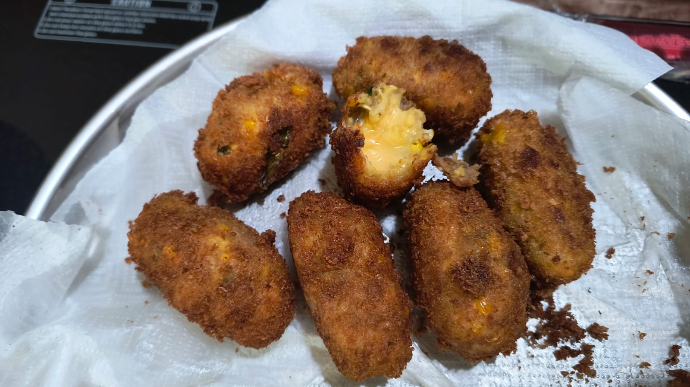

# Potato Corn Cheese Balls

Potato Corn Cheese Balls are a delicious snack made with boiled potatoes, sweet corn, and cheese. They are crispy on the outside and soft on the inside. These balls are perfect for parties, picnics, or as a teatime snack. You can serve them with ketchup or any other dip of your choice. Here is how you can make Potato Corn Cheese Balls at home.

## Ingredients
- 2 large potatoes, boiled and mashed
- 1 cup sweet corn
- 1/2 cup grated cheese
- 1/2 tsp red chili powder
- 1/2 tsp garam masala
- 1/2 tsp chaat masala
- Salt to taste
- 1/2 cup bread crumbs
- Oil for frying

## Instructions
1. In a mixing bowl, combine the grated boiled potatoes, coarsely blended sweet corn, red chili powder, garam masala, chaat masala, and salt. Mix well.
2. Take a small portion of the mixture, shape it like a thick disc, place grated cheese in the center and shape it into a ball.
3. Roll the ball in bread crumbs until it is coated evenly.
4. Heat oil in a pan and deep fry the balls until they are golden brown and crispy.
5. Remove the balls from the oil and place them on a paper towel to drain excess oil.
6. Serve the Potato Corn Cheese Balls hot with ketchup or any other dip of your choice.

Enjoy your delicious Potato Corn Cheese Balls!

